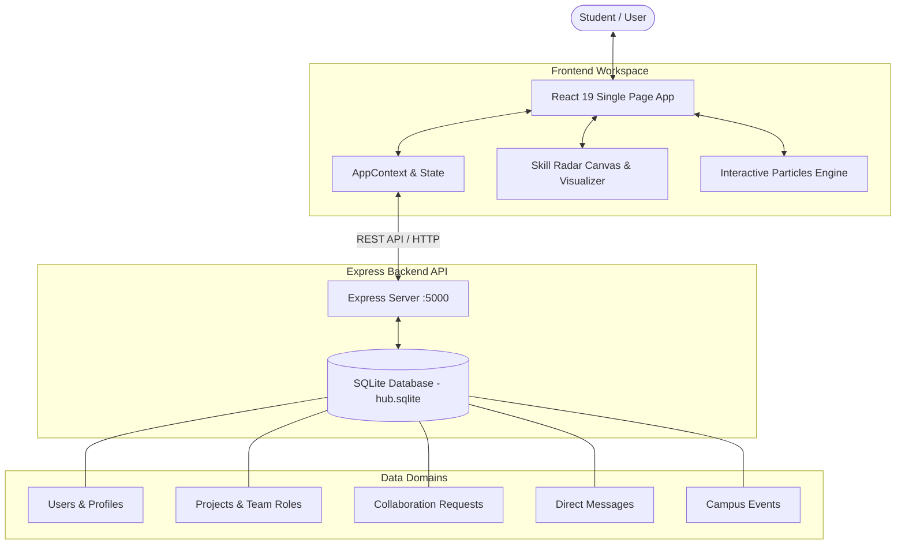

<div align="center">

  # 🎓 Campus Collaboration Hub (Nexus)
  ### *Bridging Minds, Building Futures: The Ultimate Cross-Disciplinary Student Collaboration Platform*

  [](https://react.dev/)
  [](https://vitejs.dev/)
  [](https://expressjs.com/)
  [](https://sqlite.org/)
  [](LICENSE)
  [](https://github.com/Anmol-Jain371/Campus_colab_hub/pulls)

  ---

  **Nexus** is a full-featured campus collaboration ecosystem designed to empower students across departments to connect, share ideas, discover team members with complementary skillsets, launch interdisciplinary projects, and participate in campus events.

  [Explore Features](#-key-features) • [Quick Start](#-quick-start) • [Architecture](#-architecture) • [API Reference](#-api-endpoints)

</div>

<br/>

---

## ✨ Key Features

| Feature | Description |
| :--- | :--- |
| 🔍 **Peer & Skill Discovery** | Filter and connect with students across Computer Science, Design, Business, and Engineering. Search by specific skills, tech stacks, or project availability. |
| 🚀 **Interactive Skill Radar** | Dynamic canvas visualization rendering student multi-attribute competency radars (Coding, UI/UX, Management, Data Analysis, Marketing, AI/ML). |
| 📌 **Project Marketplace** | Create, explore, and join innovation projects. Filter by domain, team size, required roles, and project status. |
| 💬 **Real-time Workspace Messaging** | Integrated multi-channel and direct message workspace for seamlessly coordinating project tasks with team members. |
| 🔔 **Notification Center** | Instant activity feed tracking collaboration requests, project application updates, and team invites. |
| 📅 **Campus Events Board** | Discover upcoming hackathons, tech talks, workshops, and inter-college collaboration summits. |
| 🎨 **Glassmorphism Design System** | Modern ultra-sleek dark/light theme, custom interactive particle backgrounds, micro-animations, and fully responsive mobile navigation. |

---

## 🛠️ Tech Stack & Architecture

### **Frontend Stack**
- **Framework**: [React 19](https://react.dev/) + [Vite 8](https://vitejs.dev/) (Lightning-fast HMR)
- **Styling**: Custom CSS Design System with Glassmorphism, CSS Grid/Flexbox, and dynamic CSS variables
- **Icons**: [Lucide React](https://lucide.dev/)
- **Visual Effects**: Custom HTML5 Canvas Particle Engine & SVG Radar Charts

### **Backend Stack**
- **Runtime**: [Node.js](https://nodejs.org/)
- **Server**: [Express 5](https://expressjs.com/) (RESTful API endpoints)
- **Database**: [SQLite3](https://sqlite.org/) with persistent relational storage and auto-seeding sample datasets
- **CORS**: Configured cross-origin resource sharing for dev & production environments

---

## 🏗️ System Architecture



---

## 🚀 Quick Start

### Prerequisites
- [Node.js](https://nodejs.org/) (v18.0.0 or higher)
- `npm` (v9.0.0 or higher)

### 1. Clone the Repository
```bash
git clone https://github.com/Anmol-Jain371/Campus_colab_hub.git
cd Campus_colab_hub
```

### 2. Install Dependencies
```bash
npm install
```

### 3. Launch the Express Backend Server
```bash
npm run server
```
*The server initializes SQLite DB (`server/hub.sqlite`), seeds default sample data if empty, and runs on `http://localhost:5000`.*

### 4. Launch the Frontend Development Server (In a separate terminal)
```bash
npm run dev
```
*Open `http://localhost:5173` in your browser.*

---

## 📡 API Endpoints

The Express API (`server/index.js`) exposes the following endpoints:

| Endpoint | Method | Description |
| :--- | :---: | :--- |
| `/api/users` | `GET` | Fetch all registered students & skill profiles |
| `/api/users/:id` | `GET` | Fetch detailed user profile by ID |
| `/api/users/:id` | `PUT` | Update user profile, avatar, skills & bio |
| `/api/projects` | `GET` | Fetch list of projects with role requirements |
| `/api/projects` | `POST` | Create a new collaboration project |
| `/api/requests` | `GET` | Fetch incoming/outgoing collaboration requests |
| `/api/requests` | `POST` | Send a new collaboration request to a peer/project |
| `/api/requests/:id` | `PUT` | Accept or reject collaboration request |
| `/api/messages` | `GET` | Fetch chat conversation history |
| `/api/messages` | `POST` | Send message to a conversation |
| `/api/events` | `GET` | Fetch active campus events and hackathons |

---

## 📁 Repository Structure

```
Campus_colab_hub/
├── public/                 # Static public assets
├── server/
│   ├── index.js            # Express API server & routes
│   ├── database.js         # SQLite database schema initialization & seed data
│   └── hub.sqlite          # SQLite database storage file
├── src/
│   ├── assets/             # Images & visual assets
│   ├── components/
│   │   ├── modals/         # Create Project, Collab Request & Profile Modals
│   │   ├── screens/        # Home, Discover, Projects, Events, Messages, Notifications, Profile
│   │   ├── visual/         # Skill Radar Chart, Workspace Loader, Interactive Particles
│   │   ├── BottomNav.jsx   # Mobile bottom navigation bar
│   │   └── Sidebar.jsx     # Desktop collapsible sidebar
│   ├── context/
│   │   └── AppContext.jsx  # Global React State & API Integration Provider
│   ├── data/
│   │   └── mockData.js     # Default mock dataset fallbacks
│   ├── App.jsx             # Main Application Router & Layout
│   ├── index.css           # Modern Glassmorphism & Tokenized CSS system
│   └── main.jsx            # React root entry point
├── package.json
├── vite.config.js
└── README.md
```

---

## 🤝 Contributing

Contributions are always welcome! Whether fixing bugs, improving UI aesthetics, or adding new feature modules:

1. Fork the Repository
2. Create your Feature Branch (`git checkout -b feature/AmazingFeature`)
3. Commit your Changes (`git commit -m 'Add some AmazingFeature'`)
4. Push to the Branch (`git push origin feature/AmazingFeature`)
5. Open a Pull Request

---

## 📜 License

Distributed under the **MIT License**. See `LICENSE` for more information.

<div align="center">
  <sub>Built with ❤️ for student innovators everywhere by <a href="https://github.com/Anmol-Jain371">Anmol Jain</a></sub>
</div>
